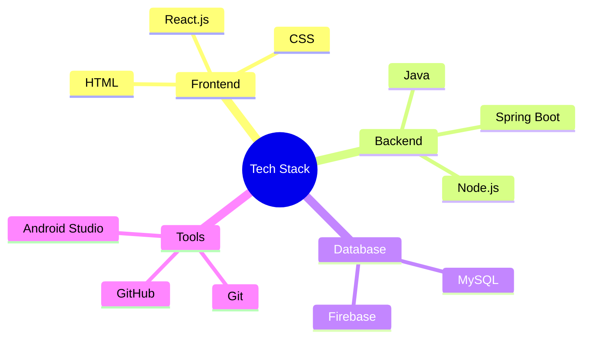

  
# 🚀 Prakash M
### Android Developer |Java Full-Stack  Enthusiast

  
  

  

## 🎯 About Me
- 🎓 **BE-CSE (2022-2026)** | 6th Semester | Aspiring **Full-Stack Developer**
- 💻 Focused on **Java, Spring Boot,SQL**
- 📱 Experienced in **Android App Development** (PicPix, Saveetha Engineering College App, Endless Escape)
- 🚀 Preparing for **On-Campus Placement**

## 💻 Tech Stack

## 🚀 Featured Projects

### 1. PicPix - Puzzle Game
*An engaging image-matching puzzle game developed in Android Studio.*

- 🎮 Flip images to match pairs and solve puzzles.
- 🔥 Optimized UI with a smooth gaming experience.
- 📱 Available on **Google Play Store** (500+ downloads).

### 2. Roadmap Generator App
*An app providing structured roadmaps and best resources in one click.*

- 🎯 Helps users kickstart their learning journey.
- 🚀 Covers Full-Stack Development, DSA, and more.
- 📖 Future updates include AI-based recommendations.

## 📈 GitHub Stats

  
  

## 🎓 Education
- **BE-CSE (2022-2026)**
  - **6th Semester** | Placement-Oriented Preparation
  - Strong foundation in **DSA, Java, and Full-Stack Development**

---

  

